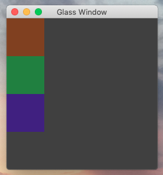

# Glass

(W.I.P) GUI Library written in pure Crystal

---


## Creating a simple Window
in order to create a simple Window one first needs to set up the UI using widgets

In order to do this I will just define a fairly simple function
```ruby
def new_ui() : Glass::Widget
	img = SF::Image.new(256, 256)
	ui = Glass::AbsolutContainer.new(img)
	ui.background_color = SF::Color.new(64_u8, 64_u8, 64_u8)
	container = Glass::VerticalContainer.new()
	container + Glass::Example.new(128_u8, 64_u8, 32_u8)
	container + Glass::Example.new(32_u8, 128_u8, 64_u8)
	container + Glass::Example.new(64_u8, 32_u8, 128_u8)
	ui + container
	ui
end
```

Starting the window now is pretty easy!

```ruby
widget = new_ui

window = Window.new "Glass Window", widget

window.run
```

the application should end up looking like this



## Contributing

1. Fork it ( https://github.com/sombrastudios/Glass/fork )
2. Create your feature branch (git checkout -b my-new-feature)
3. Commit your changes (git commit -am 'Add some feature')
4. Push to the branch (git push origin my-new-feature)
5. Create a new Pull Request

## Contributors

* [[sombrastudios]](https://github.com/sombrastudios) sombrastudios - creator, maintainer


